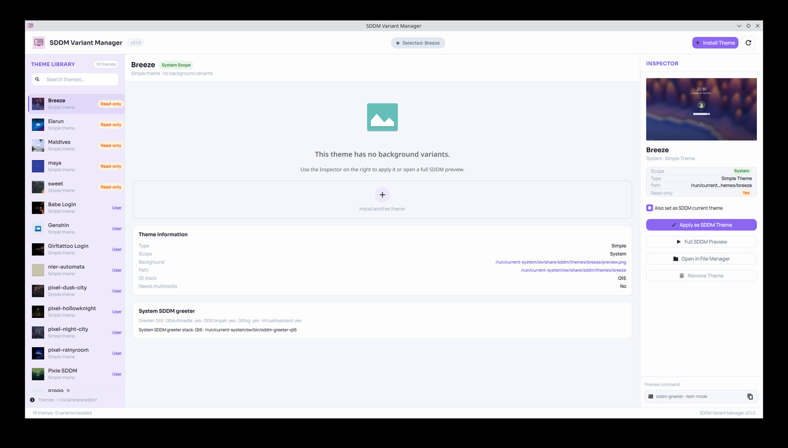
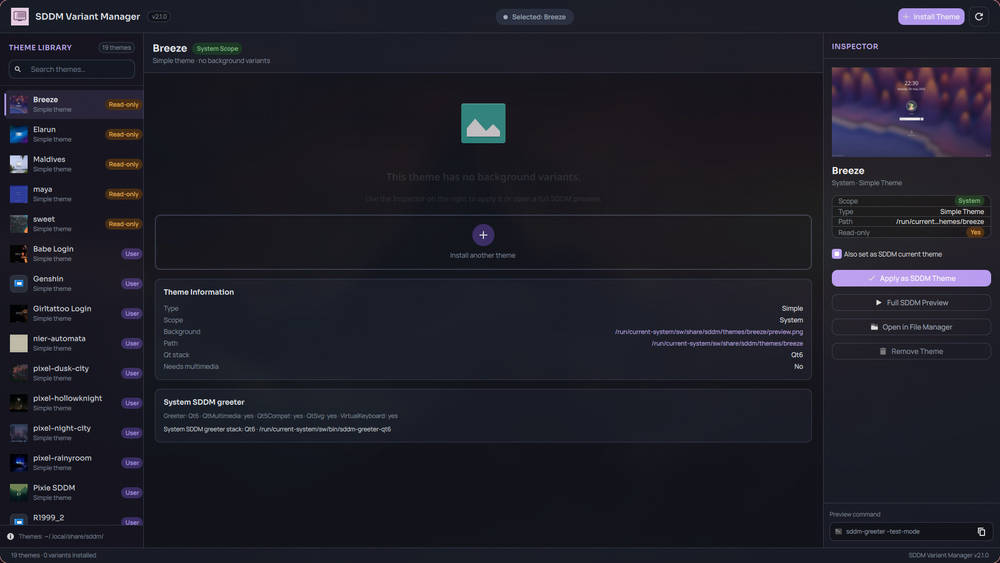

# SDDM Variant Manager

**Light mode**



**Dark mode**



Graphical tool for anyone who uses **SDDM** — whether you run **Hyprland**, **Plasma**, or another desktop — to browse, preview, apply, install, and remove login screen themes without logging out every time. It supports multi-variant collections such as [ZenMatrix Collection](https://github.com/OminduD/sddm-themes).

The interface is built with **Qt 6** and **Kirigami** (KDE-style). You do not need a Plasma session day to day; you only need SDDM and the runtime libraries listed below.

**Current version: 2.2.0**

## Why this exists

I use **Hyprland** daily with **SDDM** as my display manager and enjoy customizing the login screen. Browsing SDDM themes was frustrating: the only reliable way to see how a theme really looked was to set it, log out, and test on the actual greeter — over and over.

Themes with **multiple background variants** (collections that ship a `Themes/*.conf` folder) were worse: switching variants meant editing `metadata.desktop` or config files by hand.

KDE's SDDM theme settings (available on my Manjaro install, which also has Plasma) help with thumbnails and picking a theme, but they do not show a faithful fullscreen preview — especially for **animated backgrounds** (video, GIF, or QML animation).

SDDM Variant Manager was built to fix that: browse variants, preview backgrounds, run the real greeter in test mode, and apply changes without logging out every time.

## Who it's for

- **Hyprland, Plasma, or any setup** that uses SDDM
- Rice / theme collectors who install many login themes
- Multi-variant theme packs (e.g. ZenMatrix Collection)
- Video or animated SDDM backgrounds

## Features

- Lists **all installed SDDM themes** (`metadata.desktop`) under:
  - `/usr/share/sddm/themes/` (Arch / Manjaro / most distros)
  - `/run/current-system/sw/share/sddm/themes/` and `/var/lib/sddm/themes/` (**NixOS**)
  - `~/.local/share/sddm/themes/` (per-user)
  - Extra roots from `XDG_DATA_DIRS`
- Multi-variant themes: browse `Themes/*.conf` variants in a horizontal filmstrip, apply a variant, preview backgrounds in a large 16:9 stage
- Simple themes: apply as SDDM current theme and open a full greeter preview (no filmstrip)
- High-quality static thumbnails for variant galleries (cached JPEG frames via `ffmpeg`)
- **Install from a local folder or archive** — zip, tar, tar.gz, tar.xz, tar.bz2, tar.zst (or drag-and-drop onto the window)
- **Remove installed themes** — delete user (or writable system) themes from the theme stage (with confirmation)
- Full SDDM login preview via `sddm-greeter` / `sddm-greeter-qt6 --test-mode` (chosen automatically per theme)
- **Qt5 vs Qt6 compatibility checks**: warns when a theme stack does not match your system greeter (e.g. Qt5 theme + Qt6-only greeter, or Qt6 theme + Qt5-only greeter)
- **Greeter capability check**: detects QtMultimedia / Qt5Compat / etc., and reports missing modules (themes are never rewritten on disk for real login)
- **NixOS-aware**: system installs go to `/var/lib/sddm/themes/`; activating a theme writes a drop-in under `/etc/sddm.conf.d/` (no rebuild required)

## Requirements

### Required

- Qt 6 and KF6 Kirigami (a Plasma install on the system makes these easy to satisfy on Manjaro/Arch)
- KF6 Archive (`karchive`) — extract zip / tar archives when installing from a local file
- SDDM
- `sddm-greeter-qt6` and/or `sddm-greeter` (Qt 5 themes prefer the latter when available)
- `pkexec` (PolicyKit) for writing system theme files or system-wide installs

```bash
# Arch / Manjaro (if not already pulled in with Plasma)
sudo pacman -S karchive
# or: pamac install karchive --no-confirm
```

### Strongly recommended

- **`ffmpeg`** — builds sharp static thumbnails from theme background videos. The app still runs without it, but variant thumbnails fall back to low-resolution GIF previews.

```bash
# Arch / Manjaro
sudo pacman -S ffmpeg
# or: pamac install ffmpeg --no-confirm

# NixOS (user profile)
nix profile add nixpkgs#ffmpeg
```

Only skip `ffmpeg` if you truly cannot install it on your system.

## Build

### Classic (cmake)

```bash
cmake -B build -DCMAKE_BUILD_TYPE=Release
cmake --build build
./build/sddm-variant-manager
```

Open the project in **Qt Creator** via `CMakeLists.txt`.

### Nix / NixOS (flake)

```bash
# One-shot run without installing
nix run .

# Development shell (cmake, Qt 6, Kirigami, …)
nix develop
cmake -B build -DCMAKE_BUILD_TYPE=Debug
cmake --build build
./build/sddm-variant-manager
```

On NixOS you can also use the existing `shell.nix` / `./qtcreator-dev.sh` helpers to open Qt Creator with the correct QML plugin paths.

Self-test (install folder + remove + archive install/rescan):

```bash
sddm-variant-manager --qa-self-test
# or from a local debug build:
./build/Desktop_Nix_Qt6-Debug/sddm-variant-manager --qa-self-test
```

## Install

Pick the section for your distro. The app is **not** in official distro repos yet; packages below are the supported ways to install it.

### NixOS (recommended)

Enable flakes (`nix-command` + `flakes`) if you have not already. Do **not** copy a debug `build/` binary into the system — use the flake so Qt, Kirigami, QtMultimedia, and `ffmpeg` are wrapped.

#### 1. Quick try (no install)

```bash
nix run github:melker22/sddm-variant-manager
```

From a local clone of this repo:

```bash
nix run .
```

#### 2. User profile (single-user machines)

This is the usual install on a personal NixOS box. It puts the app in `~/.nix-profile` and the application menu.

```bash
nix profile add github:melker22/sddm-variant-manager
```

From a local clone (includes uncommitted tree changes when the git worktree is dirty):

```bash
nix profile remove sddm-variant-manager   # skip if this is the first install
nix profile add .
```

Update a GitHub-based profile install after a new release:

```bash
nix profile upgrade sddm-variant-manager
```

Then launch from the application menu or:

```bash
sddm-variant-manager
```

#### 3. System-wide via flake (multi-user machines)

Add the flake input and put the package on `environment.systemPackages`:

```nix
# flake.nix
{
  inputs = {
    nixpkgs.url = "github:NixOS/nixpkgs/nixos-unstable";
    sddm-variant-manager.url = "github:melker22/sddm-variant-manager";
  };

  outputs = { nixpkgs, sddm-variant-manager, ... }: {
    nixosConfigurations.YOUR_HOSTNAME = nixpkgs.lib.nixosSystem {
      system = "x86_64-linux";
      modules = [
        ./configuration.nix
        {
          environment.systemPackages = [
            sddm-variant-manager.packages.x86_64-linux.default
          ];
        }
      ];
    };
  };
}
```

Then rebuild:

```bash
sudo nixos-rebuild switch
# with askpass on some setups:
# sudo -A nixos-rebuild switch --flake /etc/nixos#YOUR_HOSTNAME
```

#### 4. Home Manager

```nix
# In a flake-based home-manager config:
home.packages = [
  inputs.sddm-variant-manager.packages.${pkgs.system}.default
];
```

Or vendor the package without adding a flake input:

```nix
home.packages = [
  (pkgs.callPackage ./path/to/sddm-variant-manager/nix/package.nix { })
];
```

The package wraps Qt/Kirigami (`wrapQtAppsHook`), ships **QtMultimedia** for the app UI/preview, and puts `ffmpeg` on `PATH`.

#### 5. Video themes and greeter Qt modules (real login)

The app **does not rewrite theme files** for the real login greeter. Video backgrounds need **QtMultimedia inside the system SDDM greeter**, not only in the app. On NixOS add:

```nix
services.displayManager.sddm.extraPackages = with pkgs.kdePackages; [
  qtmultimedia
  qtsvg
  qt5compat
  qtvirtualkeyboard
];
```

Do **not** set `services.displayManager.sddm.package` if Plasma already defines it — that causes a NixOS option conflict. Use `extraPackages` only.

Then `sudo nixos-rebuild switch` and log out once so the new greeter wrap is used. The app reports missing greeter modules and **Qt5 vs Qt6 theme mismatches** in the UI.

### How theme install/apply works on NixOS

NixOS keeps `/usr` and the SDDM theme tree under `/run/current-system/...` **immutable**. This app therefore:

| Action | Location |
|--------|----------|
| Scan system themes | `/run/current-system/sw/share/sddm/themes/` (read-only) |
| Install system-wide | `/var/lib/sddm/themes/` (writable, persists across rebuilds) |
| Install per-user | `~/.local/share/sddm/themes/` |
| Activate theme | writes `/etc/sddm.conf.d/99-sddm-variant-manager.conf` with `Current=` and `ThemeDir=` |

That drop-in overrides `Theme` settings from the generated `00-nixos.conf` **without** a `nixos-rebuild`. Polkit (`pkexec`) is required; Plasma/SDDM already provide it.

Home-installed themes are **copied unchanged** into `/var/lib/sddm/themes/` when activated, because the `sddm` user often cannot read `$HOME` (mode `700`). System-wide installs also fix permissions so the library UI can list `/var/lib/sddm/themes/` (path traversal on the sddm state dir when needed).

**Read-only themes** from the Nix store (e.g. `breeze`) can still be **activated** and **previewed**. Applying a **variant** (editing `metadata.desktop`) needs a writable copy — install the theme system-wide or per-user first.

#### Declarative theme only (optional)

If you prefer everything in `configuration.nix` instead of the GUI:

```nix
{ pkgs, ... }:
{
  services.displayManager.sddm = {
    enable = true;
    theme = "breeze"; # theme directory name under ThemeDir
  };
}
```

Rebuild with `sudo nixos-rebuild switch`. The GUI drop-in and declarative `theme=` can conflict — remove `/etc/sddm.conf.d/99-sddm-variant-manager.conf` if you switch fully to declarative management.

### Arch Linux / Manjaro

There is no AUR package yet. Build the native `.pkg.tar.zst` from this tree with the bundled PKGBUILD (`packaging/arch/`, currently **2.2.0**):

```bash
# needs base-devel (makepkg, pacman)
sudo pacman -S --needed base-devel
cd packaging/arch
./build-package.sh
sudo pacman -U ./sddm-variant-manager-*.pkg.tar.zst
```

Or with **pamac**:

```bash
pamac install ./sddm-variant-manager-*.pkg.tar.zst --no-confirm
```

This installs to `/usr/bin`, adds a `.desktop` entry, and pulls Qt 6 / Kirigami / `breeze-icons` via `depends`. `ffmpeg` is optional (`optdepends`) for sharp video thumbnails.

To remove later:

```bash
sudo pacman -R sddm-variant-manager
```

For **video themes at the real login screen**, install greeter modules (the app itself already depends on `qt6-multimedia`):

```bash
sudo pacman -S --needed qt6-multimedia qt6-5compat qt6-svg
```

On Hyprland / other Wayland compositors, also install `qt6-wayland` if the window does not show up.

### Fedora

No COPR yet. Install build dependencies, then compile:

```bash
sudo dnf install cmake extra-cmake-modules ninja-build gcc-c++ \
  qt6-qtbase-devel qt6-qtdeclarative-devel qt6-qtmultimedia-devel \
  qt6-qtsvg-devel qt6-qtwayland-devel \
  kf6-kirigami-devel kf6-kcoreaddons-devel kf6-ki18n-devel kf6-karchive-devel \
  breeze-icon-theme ffmpeg sddm polkit
```

Then follow [From source](#from-source-manual) below. For video login themes:

```bash
sudo dnf install qt6-qtmultimedia qt6-qt5compat qt6-qtsvg
```

### openSUSE (Tumbleweed)

```bash
sudo zypper install cmake extra-cmake-modules ninja gcc-c++ \
  qt6-base-devel qt6-declarative-devel qt6-multimedia-devel qt6-svg-devel \
  kf6-kirigami-devel kf6-kcoreaddons-devel kf6-ki18n-devel kf6-karchive-devel \
  breeze6-icons ffmpeg sddm polkit
```

Then follow [From source](#from-source-manual). Package names on Leap may differ; prefer Tumbleweed for Qt 6 / KF6.

### Debian / Ubuntu

Need a release with **Qt 6 and KF6** (Debian testing/unstable, Ubuntu 25.04+). Ubuntu 24.04 LTS is often too old for this stack.

```bash
sudo apt install cmake extra-cmake-modules ninja-build g++ \
  qt6-base-dev qt6-declarative-dev qt6-multimedia-dev qt6-svg-dev \
  kirigami-dev libkf6coreaddons-dev libkf6i18n-dev libkf6archive-dev \
  breeze-icon-theme ffmpeg sddm policykit-1
```

Then follow [From source](#from-source-manual).

### From source (manual)

Use this after installing the distro packages in the sections above (or any other distro with Qt 6.5+ and KF6 Kirigami):

```bash
cmake -B build -DCMAKE_BUILD_TYPE=Release -DCMAKE_INSTALL_PREFIX=/usr
cmake --build build
sudo cmake --install build
```

This installs the binary to `/usr/bin` and adds a `.desktop` entry. On NixOS prefer `nix profile add .` instead of `cmake --install` — an unpackaged binary will not find QML plugins.

## Usage

1. Launch **SDDM Variant Manager** from the application menu (or `sddm-variant-manager`).
2. Pick a theme in the **library** on the left.
3. For multi-variant themes, choose a variant in the **filmstrip** under the preview, then **Apply as SDDM Theme** (optional “Also set as current SDDM theme”).
4. For simple themes (no `Themes/*.conf`), apply the theme as a whole.
5. Use **Full SDDM Preview** to test the login screen.
6. Use **Remove** on the theme stage to delete a writable installed theme (confirmation required). Read-only Nix store themes cannot be deleted from the app.

### Install themes

Themes are installed only from **local files or folders** (download a ZIP/tarball from GitHub yourself if needed).

1. Click **Install Theme** at the bottom of the library (or drag a folder/archive onto the window).
2. Use **Choose Archive…** for `.zip`, `.tar`, `.tar.gz` / `.tgz`, `.tar.xz` / `.txz`, `.tar.bz2`, `.tar.zst`, or **Choose Folder…** for a directory that contains one or more themes (`metadata.desktop`).
3. Optionally enable **Install system-wide** (needs admin password).
4. Click **Install**.

You can also paste a path or **drag and drop** a theme folder or archive onto the main window.

#### Install locations

- Leave **Install system-wide** unchecked to install for your user only (`~/.local/share/sddm/themes/`).
- On **NixOS**, check **Install system-wide** to install into `/var/lib/sddm/themes/` (not `/usr/share/...`).
- On Arch / Manjaro, system-wide installs go to `/usr/share/sddm/themes/`.

All folders containing a valid `metadata.desktop` (+ QML entry) in the source are installed.

### Qt5 vs Qt6 themes

Many older themes (e.g. Layan-style Plasma greeters) use **QtQuick.Controls 1.x** and only work with a **Qt5** greeter. Modern systems often ship only **`sddm-greeter-qt6`**.

The app detects the theme stack and your greeter stack and warns when they do not match:

| Theme | System greeter | Result |
|-------|----------------|--------|
| Qt5 (Controls 1.x) | Qt6 only | Warning: incompatible at login |
| Qt6 | Qt5 only | Warning: incompatible at login |
| Matching stacks | Matching | OK |

Prefer Qt6 themes on modern SDDM, or use a Qt5 greeter if your distro still provides `sddm-greeter`.

### Close full SDDM preview

The preview opens the real SDDM greeter in test mode and covers the entire screen. **SDDM Variant Manager stays open in the background** — you need a separate way to dismiss the preview window.

#### On KDE Plasma

1. Press **Alt+Tab**
2. Select **SDDM Variant Manager**
3. Click **Close preview**

#### On Hyprland

1. Focus the preview window (usually already focused).
2. Press your Hyprland **close window** keybind (often `Super+Q` or similar).

Applying variants, system-wide installs, removals of system themes, and writing SDDM config require administrator authentication via Polkit.

## License

Copyright (C) 2026 Melker Halberd Pereira Alves

This program is free software: you can redistribute it and/or modify it under the terms of the GNU General Public License as published by the Free Software Foundation, either version 3 of the License, or (at your option) any later version.

See [LICENSE](LICENSE) for the full text.

## Author

Melker Halberd Pereira Alves <melker168@gmail.com>
