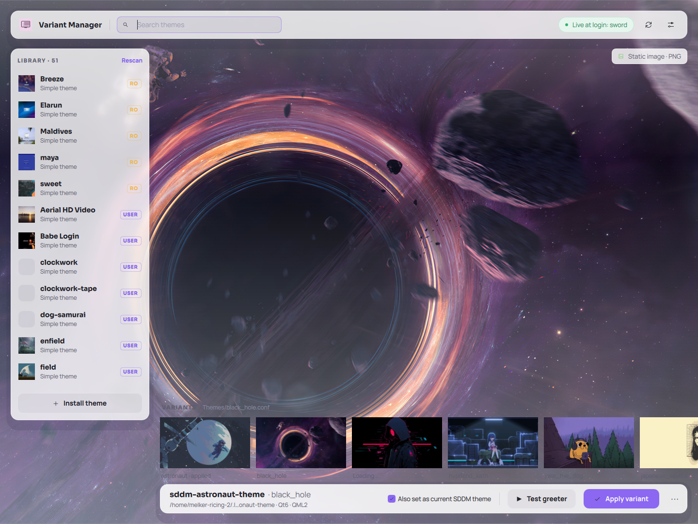
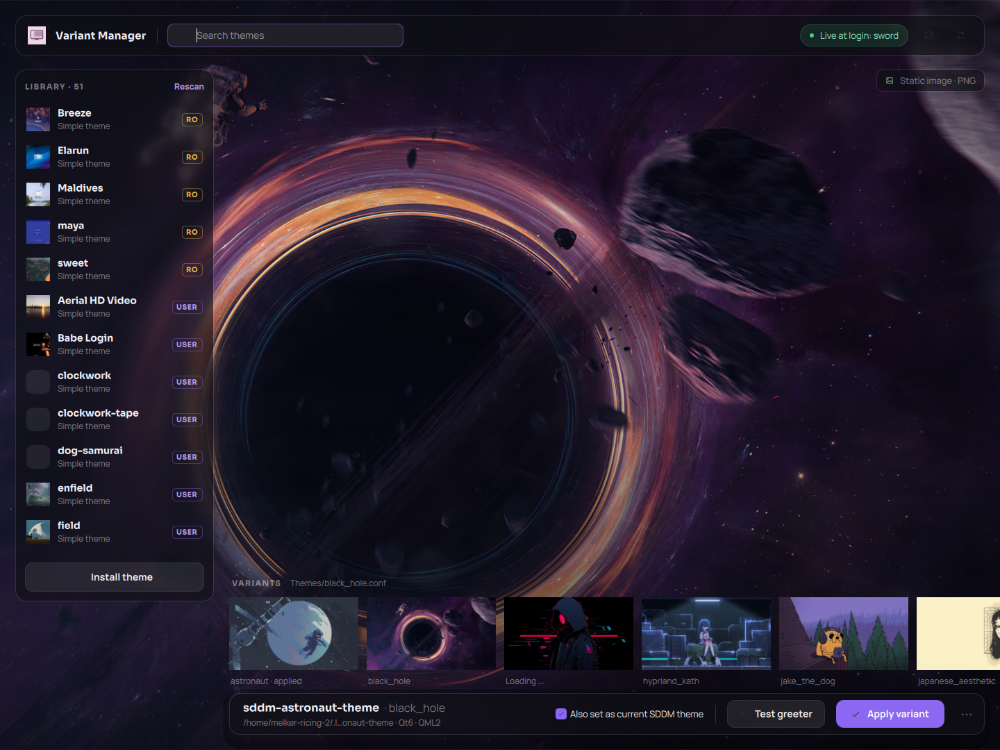

# SDDM Variant Manager

[](LICENSE)
[](https://github.com/melker22/sddm-variant-manager/releases)
[](https://github.com/melker22/sddm-variant-manager#nixos)
[](https://www.qt.io/)

Browse, preview, apply, install, and remove **SDDM** login themes without logging out every time. Works on **Hyprland**, **Plasma**, and any other desktop that uses SDDM. Multi-variant collections such as [ZenMatrix Collection](https://github.com/OminduD/sddm-themes) show up as a filmstrip under a large 16:9 preview.

Built with **Qt 6** and **Kirigami**. You do not need a Plasma session day to day — only SDDM and the libraries listed under [Requirements](#requirements).

**Current version: 2.3.0**

<table>
  <tr>
    <td align="center"><strong>Light</strong></td>
    <td align="center"><strong>Dark</strong></td>
  </tr>
  <tr>
    <td></td>
    <td></td>
  </tr>
</table>

## Contents

- [Why this exists](#why-this-exists)
- [Features](#features)
- [Install](#install)
  - [NixOS](#nixos)
  - [Arch Linux / Manjaro](#arch-linux--manjaro)
  - [Fedora, openSUSE, Debian / Ubuntu](#fedora-opensuse-debian--ubuntu)
  - [From source](#from-source-manual)
- [Usage](#usage)
- [Requirements](#requirements)
- [Build](#build)
- [License](#license)

## Why this exists

I use **Hyprland** daily with **SDDM** and like customizing the login screen. The only reliable way to see how a theme really looked was to set it, log out, and test on the actual greeter — over and over.

Themes with **multiple background variants** (`Themes/*.conf`) were worse: switching meant editing `metadata.desktop` by hand. KDE’s SDDM settings help with thumbnails, but they do not show a faithful fullscreen preview — especially for **video, GIF, or QML** backgrounds.

This app fixes that: browse variants, preview backgrounds, run the **real greeter** in test mode, and apply changes without logging out every time.

## Features

**Library and preview**

- Lists every installed SDDM theme (`metadata.desktop`) from:
  - `/usr/share/sddm/themes/` (Arch / Manjaro / most distros)
  - `/run/current-system/sw/share/sddm/themes/` and `/var/lib/sddm/themes/` (**NixOS**)
  - `~/.local/share/sddm/themes/` (per-user)
  - extra roots from `XDG_DATA_DIRS`
- Multi-variant themes: horizontal filmstrip, apply a variant, large 16:9 stage
- Simple themes: apply as the current SDDM theme and open a full greeter preview
- Sharp static thumbnails for video variants (cached JPEG frames via `ffmpeg`)

**Install and remove**

- Local folder or archive: zip, tar, tar.gz, tar.xz, tar.bz2, tar.zst (or drag-and-drop)
- **GitHub (experimental):** clone a public repo, **read** `install.sh` (never execute it), copy theme folders into this distro’s SDDM directories
- Remove writable user or system themes from the theme stage (with confirmation)

**Compatibility**

- Full login preview via `sddm-greeter` / `sddm-greeter-qt6 --test-mode` (picked automatically)
- Warns when a theme’s Qt 5 / Qt 6 stack does not match your greeter
- Detects missing greeter modules (QtMultimedia, Qt5Compat, …). Themes are **never rewritten** on disk for real login
- **NixOS-aware:** system installs go to `/var/lib/sddm/themes/`; activating a theme writes `/etc/sddm.conf.d/` (no rebuild)

## Install

The app is **not** in official distro repos yet. Use one of the paths below.

### NixOS

Enable flakes (`nix-command` + `flakes`). Do **not** copy a debug `build/` binary into the system — the flake wraps Qt, Kirigami, QtMultimedia, `ffmpeg`, and `git`.

**Try without installing**

```bash
nix run github:melker22/sddm-variant-manager
```

From a local clone: `nix run .`

**User profile** (usual install on a personal machine — application menu + `~/.nix-profile`)

```bash
nix profile add github:melker22/sddm-variant-manager
sddm-variant-manager
```

From a local clone (includes uncommitted tree changes when the worktree is dirty):

```bash
nix profile remove sddm-variant-manager   # skip if this is the first install
nix profile add .
```

After a new release: `nix profile upgrade sddm-variant-manager`

<details>
<summary>System-wide flake, Home Manager, and greeter video modules</summary>

**System-wide** — add the flake input and put the package on `environment.systemPackages`:

```nix
# flake.nix
{
  inputs = {
    nixpkgs.url = "github:NixOS/nixpkgs/nixos-unstable";
    sddm-variant-manager.url = "github:melker22/sddm-variant-manager";
  };

  outputs = { nixpkgs, sddm-variant-manager, ... }: {
    nixosConfigurations.YOUR_HOSTNAME = nixpkgs.lib.nixosSystem {
      system = "x86_64-linux";
      modules = [
        ./configuration.nix
        {
          environment.systemPackages = [
            sddm-variant-manager.packages.x86_64-linux.default
          ];
        }
      ];
    };
  };
}
```

Then `sudo nixos-rebuild switch`.

**Home Manager**

```nix
home.packages = [
  inputs.sddm-variant-manager.packages.${pkgs.system}.default
];
```

Or vendor the package without a flake input:

```nix
home.packages = [
  (pkgs.callPackage ./path/to/sddm-variant-manager/nix/package.nix { })
];
```

**Video themes at the real login screen** need QtMultimedia **inside the SDDM greeter**, not only in this app:

```nix
services.displayManager.sddm.extraPackages = with pkgs.kdePackages; [
  qtmultimedia
  qtsvg
  qt5compat
  qtvirtualkeyboard
];
```

Do **not** set `services.displayManager.sddm.package` if Plasma already defines it (option conflict). Use `extraPackages` only, rebuild, and log out once.

</details>

<details>
<summary>How install and apply work on NixOS</summary>

`/usr` and the Nix store theme tree are **immutable**. This app therefore:

| Action | Location |
|--------|----------|
| Scan system themes | `/run/current-system/sw/share/sddm/themes/` (read-only) |
| Install system-wide | `/var/lib/sddm/themes/` (writable, persists across rebuilds) |
| Install per-user | `~/.local/share/sddm/themes/` |
| Activate theme | `/etc/sddm.conf.d/99-sddm-variant-manager.conf` (`Current=` and `ThemeDir=`) |

That drop-in overrides `Theme` from generated `00-nixos.conf` **without** a rebuild. Polkit (`pkexec`) is required.

Home-installed themes are **copied unchanged** into `/var/lib/sddm/themes/` when activated, because the `sddm` user often cannot read `$HOME` (mode `700`).

Read-only Nix store themes (e.g. `breeze`) can still be **activated** and **previewed**. Applying a **variant** (editing `metadata.desktop`) needs a writable copy — install the theme first.

If you prefer a fully declarative theme instead of the GUI:

```nix
services.displayManager.sddm = {
  enable = true;
  theme = "breeze"; # directory name under ThemeDir
};
```

The GUI drop-in and declarative `theme=` can conflict — remove `/etc/sddm.conf.d/99-sddm-variant-manager.conf` if you switch fully to declarative management.

</details>

### Arch Linux / Manjaro

There is no AUR package yet. Build from `packaging/arch/` (currently **2.3.0**):

```bash
sudo pacman -S --needed base-devel
cd packaging/arch
./build-package.sh
sudo pacman -U ./sddm-variant-manager-*.pkg.tar.zst
```

Or `pamac install ./sddm-variant-manager-*.pkg.tar.zst --no-confirm`.

This installs to `/usr/bin` and adds a `.desktop` entry. Qt 6, Kirigami, and `breeze-icons` come in via `depends`. `ffmpeg` and `git` are `optdepends` (thumbnails and experimental GitHub clone).

Remove later with `sudo pacman -R sddm-variant-manager`.

For **video at the real login screen**:

```bash
sudo pacman -S --needed qt6-multimedia qt6-5compat qt6-svg
```

On Hyprland / other Wayland compositors, install `qt6-wayland` if the window does not appear.

### Fedora, openSUSE, Debian / Ubuntu

No COPR / OBS packages yet. Install build dependencies, then follow [From source](#from-source-manual).

<details>
<summary>Fedora</summary>

```bash
sudo dnf install cmake extra-cmake-modules ninja-build gcc-c++ \
  qt6-qtbase-devel qt6-qtdeclarative-devel qt6-qtmultimedia-devel \
  qt6-qtsvg-devel qt6-qtwayland-devel \
  kf6-kirigami-devel kf6-kcoreaddons-devel kf6-ki18n-devel kf6-karchive-devel \
  breeze-icon-theme ffmpeg git sddm polkit
```

For video login themes: `sudo dnf install qt6-qtmultimedia qt6-qt5compat qt6-qtsvg`

</details>

<details>
<summary>openSUSE Tumbleweed</summary>

```bash
sudo zypper install cmake extra-cmake-modules ninja gcc-c++ \
  qt6-base-devel qt6-declarative-devel qt6-multimedia-devel qt6-svg-devel \
  kf6-kirigami-devel kf6-kcoreaddons-devel kf6-ki18n-devel kf6-karchive-devel \
  breeze6-icons ffmpeg git sddm polkit
```

Package names on Leap may differ; prefer Tumbleweed for Qt 6 / KF6.

</details>

<details>
<summary>Debian / Ubuntu</summary>

Need **Qt 6 and KF6** (Debian testing/unstable, Ubuntu 25.04+). Ubuntu 24.04 LTS is often too old.

```bash
sudo apt install cmake extra-cmake-modules ninja-build g++ \
  qt6-base-dev qt6-declarative-dev qt6-multimedia-dev qt6-svg-dev \
  kirigami-dev libkf6coreaddons-dev libkf6i18n-dev libkf6archive-dev \
  breeze-icon-theme ffmpeg git sddm policykit-1
```

</details>

### From source (manual)

After installing the distro packages above (or any distro with Qt 6.5+ and KF6 Kirigami):

```bash
cmake -B build -DCMAKE_BUILD_TYPE=Release -DCMAKE_INSTALL_PREFIX=/usr
cmake --build build
sudo cmake --install build
```

This installs the binary to `/usr/bin` and a `.desktop` entry. On NixOS prefer `nix profile add .` — an unpackaged binary will not find QML plugins.

## Usage

1. Launch **SDDM Variant Manager** from the application menu (or `sddm-variant-manager`).
2. Pick a theme in the **library** on the left.
3. For multi-variant themes, choose a variant in the **filmstrip**, then **Apply as SDDM Theme** (optional “Also set as current SDDM theme”).
4. For simple themes (no `Themes/*.conf`), apply the theme as a whole.
5. Use **Full SDDM Preview** to test the login screen.
6. Use **Remove** on the theme stage to delete a writable installed theme. Read-only Nix store themes cannot be deleted from the app.

Applying variants, system-wide installs, system theme removals, and writing SDDM config require Polkit (`pkexec`).

### Install themes from a file

1. Click **Install Theme** at the bottom of the library (or drop a folder/archive onto the window).
2. **From file:** **Choose Archive…** (`.zip`, `.tar`, `.tar.gz` / `.tgz`, `.tar.xz` / `.txz`, `.tar.bz2`, `.tar.zst`) or **Choose Folder…** (must contain `metadata.desktop`). You can also paste a path.
3. Optionally enable **Install system-wide** (admin password).
4. Click **Install**.

**Where it lands**

- Unchecked: `~/.local/share/sddm/themes/`
- NixOS, system-wide: `/var/lib/sddm/themes/` (not `/usr/share/...`)
- Arch / Manjaro, system-wide: `/usr/share/sddm/themes/`

Every folder with a valid `metadata.desktop` (+ QML entry) in the source is installed.

### Install themes from GitHub (experimental)

**BETA.** Needs `git` on `PATH`. Only **public GitHub** repos (`https://github.com/user/repo` or `git@github.com:user/repo.git`).

1. **Install Theme** → **GitHub**
2. Paste the repository URL
3. User vs system-wide, then **Install**

The app clones the repo, **reads** `install.sh` / `install-sddm.sh` (it does **not** run the script), copies theme folders into this distro’s SDDM directories, and falls back to scanning the clone if there is no usable script. If the script points at a non-standard location, the theme is still installed into the usual SDDM dirs and the status message says so. Extra steps in the script (fonts, Plymouth, …) are ignored. The Nix package already wraps `git`.

### Qt 5 vs Qt 6 themes

Many older themes (Layan-style Plasma greeters, …) use **QtQuick.Controls 1.x** and only work with a **Qt 5** greeter. Modern systems often ship only **`sddm-greeter-qt6`**.

| Theme | System greeter | Result |
|-------|----------------|--------|
| Qt 5 (Controls 1.x) | Qt 6 only | Warning: incompatible at login |
| Qt 6 | Qt 5 only | Warning: incompatible at login |
| Matching stacks | Matching | OK |

Prefer Qt 6 themes on modern SDDM, or keep a Qt 5 greeter if your distro still provides `sddm-greeter`.

### Close the full SDDM preview

The preview is the real greeter in test mode and covers the whole screen. **This app stays open in the background.**

**Plasma:** Alt+Tab → **SDDM Variant Manager** → **Close preview**

**Hyprland:** focus the preview (usually already focused) and use your close-window bind (often `Super+Q`).

## Requirements

**Required**

- Qt 6 and KF6 Kirigami (a Plasma install usually pulls these on Arch/Manjaro)
- KF6 Archive (`karchive`) — zip / tar when installing from a local file
- SDDM
- `sddm-greeter-qt6` and/or `sddm-greeter` (Qt 5 themes prefer the latter when available)
- `pkexec` (PolicyKit) for system theme files and system-wide installs

```bash
# Arch / Manjaro (if not already pulled in with Plasma)
sudo pacman -S karchive
```

**Strongly recommended — `ffmpeg`**

Sharp thumbnails from video backgrounds. Without it, variant thumbnails fall back to low-resolution GIF previews.

```bash
# Arch / Manjaro
sudo pacman -S ffmpeg

# NixOS user profile (not needed if you install this app via the flake — ffmpeg is wrapped)
nix profile add nixpkgs#ffmpeg
```

**Optional — `git`**

Needed for **Install Theme → GitHub**. The app clones the repo and reads `install.sh`; it never runs the script. The Nix package wraps `git`.

```bash
sudo pacman -S git   # Arch / Manjaro
```

## Build

**CMake**

```bash
cmake -B build -DCMAKE_BUILD_TYPE=Release
cmake --build build
./build/sddm-variant-manager
```

Open the project in **Qt Creator** via `CMakeLists.txt`.

**Nix flake**

```bash
nix run .          # one-shot
nix develop        # cmake, Qt 6, Kirigami, git, …
cmake -B build -DCMAKE_BUILD_TYPE=Debug
cmake --build build
./build/sddm-variant-manager
```

On NixOS you can also use `shell.nix` / `./qtcreator-dev.sh` so Qt Creator sees the correct QML plugin paths.

Self-test (folder install, remove, `install.sh` parser fixtures, archive install; **no network**):

```bash
sddm-variant-manager --qa-self-test
# or: ./build/Desktop_Nix_Qt6-Debug/sddm-variant-manager --qa-self-test
```

## License

Copyright (C) 2026 Melker Halberd Pereira Alves

This program is free software: you can redistribute it and/or modify it under the terms of the GNU General Public License as published by the Free Software Foundation, either version 3 of the License, or (at your option) any later version.

See [LICENSE](LICENSE) for the full text.

## Author

Melker Halberd Pereira Alves <melker168@gmail.com>
